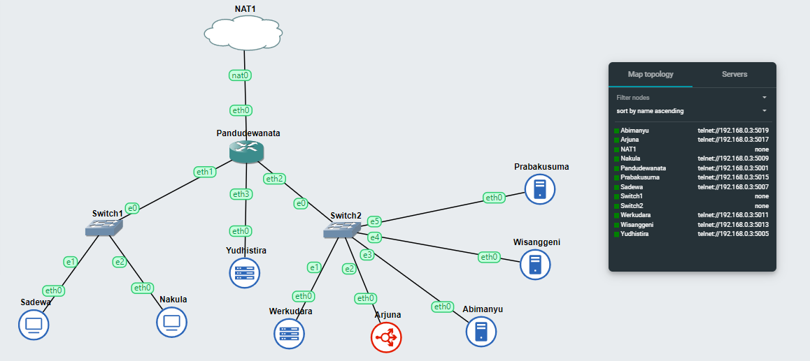
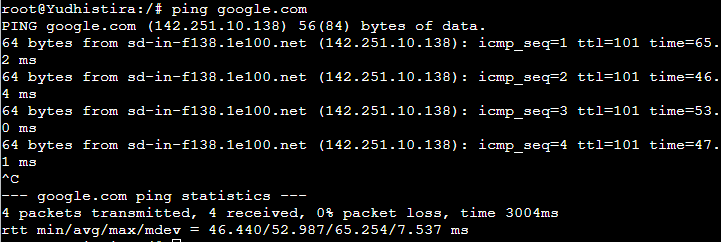
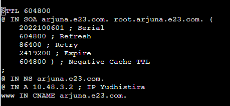
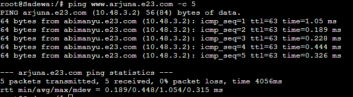
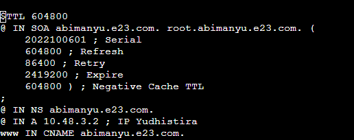
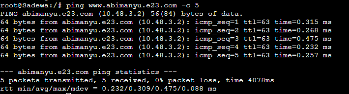

# Jarkom-Modul-2-E23-2023

Laporan Resmi Praktikum Jaringan Komputer Modul 2
***
## Anggota Kelompok
1. Ilham Insan Wafi (5025211255)
2. Elmira Farah Azalia (5025211197)

---
### Soal 1
---
Membuat topologi sesuai deskripsi : Yudhistira akan digunakan sebagai DNS Master, Werkudara sebagai DNS Slave, Arjuna merupakan Load Balancer yang terdiri dari beberapa Web Server yaitu Prabakusuma, Abimanyu, dan Wisanggeni.

---
### Jawaban
---
- Buat topologi sesuai dengan soal, yaitu Tambahkan beberapa node ethernet switch dan ubuntu, lalu buat hubungan antar node dan nama-nama dari node disesuaikan dengan ketentuan soal.



- Lakukan konfigurasi pada setiap node

Pandudewanata:
```
auto eth0
iface eth0 inet dhcp

auto eth1
iface eth1 inet static
	address 10.48.1.1
	netmask 255.255.255.0

auto eth2
iface eth2 inet static
	address 10.48.2.1
	netmask 255.255.255.0

auto eth3
iface eth3 inet static
	address 10.48.3.1
	netmask 255.255.255.0
```

Yudhistira:
```
auto eth0
iface eth0 inet static
	address 10.48.3.2
	netmask 255.255.255.0
	gateway 10.48.3.1
```
Sadewa:
```
auto eth0
iface eth0 inet static
	address 10.48.1.2
	netmask 255.255.255.0
	gateway 10.48.1.1
```
Nakula:
```
auto eth0
iface eth0 inet static
	address 10.48.1.3
	netmask 255.255.255.0
	gateway 10.48.1.1
```
Werkudara:
```
auto eth0
iface eth0 inet static
	address 10.48.2.2
	netmask 255.255.255.0
	gateway 10.48.2.1
```
Arjuna:
```
auto eth0
iface eth0 inet static
	address 10.48.2.3
	netmask 255.255.255.0
	gateway 10.48.2.1
```
Abimanyu:
```
auto eth0
iface eth0 inet static
	address 10.48.2.4
	netmask 255.255.255.0
	gateway 10.48.2.1
```
Wisanggeni:
```
auto eth0
iface eth0 inet static
	address 10.48.2.5
	netmask 255.255.255.0
	gateway 10.48.2.1
```
Prabakusuma:
```
auto eth0
iface eth0 inet static
	address 10.48.2.6
	netmask 255.255.255.0
	gateway 10.48.2.1
```

- Lakukan config berikut agar topologi yang dibuat bisa mengakses jaringan keluar:
> Ketikkan command dibawah ini pada router Pandudewanata
```
iptables -t nat -A POSTROUTING -o eth0 -j MASQUERADE -s [Prefix IP].0.0/16
```
> Lalu cek IP DNS, dengan mengetikkan command dibawah ini pada pandudewanata
```
cat /etc/resolv.conf
```
Hasilnya adalah:
```
nameserver 192.168.122.1
```
> Lalu ketikkan command dibawah ini di node ubuntu yang lain
```
echo nameserver 192.168.122.1 > /etc/resolv.conf.
```
- Cek semua node sekarang seharusnya sudah bisa melakukan ping ke google, pada contoh dibawah mencoba ping google di Yudhistira
  


---
### Soal 2
---
Buatlah website utama pada node arjuna dengan akses ke arjuna.yyy.com dengan alias www.arjuna.yyy.com dengan yyy merupakan kode kelompok.
---
### Jawaban
---
- Buka Yudhistira dan update package lists dengan menjalankan command:
```
apt-get update
```
- Setalah melakukan update silahkan install aplikasi bind9 pada Yudhistira dengan perintah:
```
 apt-get install bind9 -y
```
- Lakukan perintah pada Yudhistira. Isikan seperti berikut:
```
nano /etc/bind/named.conf.local
```
- Isikan configurasi domain arjuna.e23.com sesuai dengan syntax berikut:
```
zone "arjuna.e23.com" {
	type master;
	file "/etc/bind/prak2/arjuna.e23.com";
};
```
- Buat folder `prak2` di dalam `/etc/bind`
```
mkdir /etc/bind/prak2
```
- Copykan file db.local pada path `/etc/bind` ke dalam folder prak2 yang baru saja dibuat dan ubah namanya menjadi arjuna.e23.com
```
cp /etc/bind/db.local /etc/bind/prak2/arjuna.e23.com
```
- Kemudian buka file arjuna.e23.com dan edit seperti gambar berikut dengan IP Yudhistira 
```
nano /etc/bind/prak2/arjuna.e23.com
```



- Restart bind9 dengan perintah
```
service bind9 restart
```
- Cek dengan melakukan ping www.arjuna.e23.com pada client sadewa
  


---
### Soal 3
---

Buatlah website utama pada node arjuna dengan akses ke abimanyu.yyy.com dengan alias www.abimanyu.yyy.com dengan yyy merupakan kode kelompok.

---
### Jawaban
---
- Lakukan perintah pada Yudhistira. Isikan seperti berikut:
```
nano /etc/bind/named.conf.local
```
- Isikan configurasi domain abimanyu.e23.com sesuai dengan syntax berikut:
```
zone "abimanyu.e23.com" {
	type master;
	file "/etc/bind/prak2/abimanyu.e23.com";
};
```
- Copykan file db.local pada path `/etc/bind` ke dalam folder prak2 yang baru saja dibuat dan ubah namanya menjadi abimanyu.e23.com
```
cp /etc/bind/db.local /etc/bind/prak2/abimanyu.e23.com
```
- Kemudian buka file abimanyu.e23.com dan edit seperti gambar berikut dengan IP Yudhistira 
```
nano /etc/bind/prak2/abimanyu.e23.com
```



- Restart bind9 dengan perintah
```
service bind9 restart
```
- Cek dengan melakukan ping www.abimanyu.e23.com pada client sadewa
  


---
### Soal 4
---

Kemudian, karena terdapat beberapa web yang harus di-deploy, buatlah subdomain parikesit.abimanyu.yyy.com yang diatur DNS-nya di Yudhistira dan mengarah ke Abimanyu.

---
### Jawaban
---
- Tambahkan subdomain parikesit di file abimanyu.e23.com
```
echo '$TTL 604800
@ IN SOA abimanyu.e23.com. root.abimanyu.e23.com. (
    2022100601 ; Serial
    604800 ; Refresh
    86400 ; Retry
    2419200 ; Expire
    604800 ) ; Negative Cache TTL
;
@ IN NS abimanyu.e23.com.
@ IN A 10.48.3.2 ; IP Yudhistira
www IN CNAME abimanyu.e23.com.
parikesit IN A 10.48.2.4
' > /etc/bind/prak2/abimanyu.e23.com
```
- Restart bind9 dengan perintah
```
service bind9 restart
```
- Cek dengan melakukan ping parikesit.abimanyu.e23.com pada client sadewa


---
### Soal 5
---

Buat juga reverse domain untuk domain utama. (Abimanyu saja yang direverse)

---
### Jawaban
---


---
### Soal 6
---

Agar dapat tetap dihubungi ketika DNS Server Yudhistira bermasalah, buat juga Werkudara sebagai DNS Slave untuk domain utama.

---
### Jawaban
---


---
### Soal 7
---

Seperti yang kita tahu karena banyak sekali informasi yang harus diterima, buatlah subdomain khusus untuk perang yaitu baratayuda.abimanyu.yyy.com dengan alias www.baratayuda.abimanyu.yyy.com yang didelegasikan dari Yudhistira ke Werkudara dengan IP menuju ke Abimanyu dalam folder Baratayuda.

---
### Jawaban
---


---
### Soal 8
---

Untuk informasi yang lebih spesifik mengenai Ranjapan Baratayuda, buatlah subdomain melalui Werkudara dengan akses rjp.baratayuda.abimanyu.yyy.com dengan alias www.rjp.baratayuda.abimanyu.yyy.com yang mengarah ke Abimanyu.

---
### Jawaban
---


---
### Soal 9
---

Arjuna merupakan suatu Load Balancer Nginx dengan tiga worker (yang juga menggunakan nginx sebagai webserver) yaitu Prabakusuma, Abimanyu, dan Wisanggeni. Lakukan deployment pada masing-masing worker.

---
### Jawaban
---

## ArjunaLoadBalancer
Install Bind9 dan Nginx:

```
 apt-get update
 apt-get install bind9 nginx
```

## PrabukusumaWebServer

```
echo nameserver 192.168.122.1 > /etc/resolv.conf


apt-get update && apt install nginx php php-fpm -y


mkdir /var/www/jarkom


nano /var/www/jarkom/index.php

echo '<?php
echo "Hello World from prabukusuma";
?>' > /var/www/jarkom/index.php

```
echo '
 server {


        listen 80;


        root /var/www/jarkom;


        index index.php index.html index.htm;
        server_name _;


        location / {
                        try_files $uri $uri/ /index.php?$query_string;
        }

        location ~ \.php$ {
        include snippets/fastcgi-php.conf;
        fastcgi_pass unix:/var/run/php/php7.2-fpm.sock;
        }


 location ~ /\.ht {
                        deny all;
        }


        error_log /var/log/nginx/jarkom_error.log;
        access_log /var/log/nginx/jarkom_access.log;
 }
' > /etc/nginx/sites-available/jarkom


ln -s /etc/nginx/sites-available/jarkom /etc/nginx/sites-enabled/jarkom

rm /etc/nginx/sites-enabled/default

service nginx restart

```

Ulangi pada worker lainnya AbimanyuWebServer dan WisanggeniWebServer


---
### Soal 10
---

Kemudian gunakan algoritma Round Robin untuk Load Balancer pada Arjuna. Gunakan server_name pada soal nomor 1. Untuk melakukan pengecekan akses alamat web tersebut kemudian pastikan worker yang digunakan untuk menangani permintaan akan berganti ganti secara acak. Untuk webserver di masing-masing worker wajib berjalan di port 8001-8003. Contoh
    - Prabakusuma:8001
    - Abimanyu:8002
    - Wisanggeni:8003

---
### Jawaban
---

##ArjunaLoadBalancer

nano `/etc/nginx/sites-available/arjuna

```
http {
    upstream workers {
        server 10.48.2.6:8001; # IP Prabakusuma
        server 10.48.2.4:8002; # IP Abimanyu
        server 10.48.2.5:8003; # IP Wisanggeni
    }

    server {
        listen 80;
        server_name arjuna.e23.com;
        location / {
            proxy_pass http://workers;
        }
    }
}

 ln -s /etc/nginx/sites-available/jarkom /etc/nginx/sites-enabled
```

##NakulaClient
Lakukan pengujian pada client Nakula/lain dengan command:
```
lynx http://arjuna.e23.com
```

---
### Soal 11
---

Selain menggunakan Nginx, lakukan konfigurasi Apache Web Server pada worker Abimanyu dengan web server www.abimanyu.yyy.com. Pertama dibutuhkan web server dengan DocumentRoot pada /var/www/abimanyu.yyy

---
### Jawaban
---

## AbimanyuWebServer

Instalasi sesuai perintah soal

```
apt-get install apache2
apt-get install wget
apt-get install unzip
```

Import file dari google drive yang disediakan pada soal

```
wget --no-check-certificate 'https://docs.google.com/uc?export=download&id=1a4V23hwK9S7hQEDEcv9FL14UkkrHc-Zc' -O abi
```

Unzip dan tepatkan pada `/var/www/abimanyu.e23`

```
unzip abi -d abimanyu.e23
rm abi
mv abimanyu.e23/abimanyu.yyy.com/* abimanyu.e23
rmdir abimanyu.e23/abimanyu.yyy.com
```

Nano `abimanyu.e23.conf` pada `/etc/apache2/sites-available`
cp isi `000-default.conf` ke dalamnya

```
cp 000-default.conf abimanyu.e23.conf
```

Pada tag VirtualHost, isi dengan konfigurasi nama server, alias server, admin server dan pasang DocumentRoot pada `/var/www/abimanyu.e23`

test `lynx abimanyu.e23.com` 

---
### Soal 12
---

Setelah itu ubahlah agar url www.abimanyu.yyy.com/index.php/home menjadi www.abimanyu.yyy.com/home.

---
### Jawaban
---
Nano `/etc/apache2/sites-available/abimanyu.e23.conf`

MKDIR `/var/www/abimanyu.e23` 
Tambah konfigurasi "Options +Indexes" dan berikan alias untuk `/var/www/abimanyu.e23/index.php/home` menjadi `/home`

test `lynx abimanyu.e23.com/home'


---
### Soal 13
---

Selain itu, pada subdomain www.parikesit.abimanyu.yyy.com, DocumentRoot disimpan pada /var/www/parikesit.abimanyu.yyy

---
### Jawaban
---

Import file dari google drive yang disediakan pada soal

```
wget --no-check-certificate 'https://drive.google.com/drive/folders/15Wr1eTQqn_vZzqkTXEAKF7tgULsxkxfe' -O pari
```

Unzip dan tepatkan pada `/var/www/parikesit.abimanyu.e23/abimanyu.e23`

```
unzip pari -d parikesit.abimanyu.e23
rm pari
mv parikesit.abimanyu.e23/parikesit.abimanyu.yyy.com/* parikesit.abimanyu.e23
rmdir parikesit.abimanyu.e23/parikesit.abimanyu.yyy.com
```

MKDIR `secret` di dalam directory `/var/www/parikesit.abimanyu.e23/abimanyu.e23` dan isi dengan sebuah file html bebas

```
mkdir parikesit.abimanyu.e23/secret
cd parikesit.abimanyu.e23/secret
echo '# bebas lepas' > bebas.html
```

nano `parikesit.abimanyu.e23.conf` pada `/etc/apache2/sites-available` 
cp `000-default.conf`

```
cp 000-default.conf parikesit.abimanyu.e23.conf
```

Pada tag VirtualHost, beri konfigurasi nama server, alias server, admin server dan pasang DocumentRoot pada `/var/www/abimanyu.e23`

test `lynx parikesit.abimanyu.e23.com` 


---
### Soal 14

---
Pada subdomain tersebut folder /public hanya dapat melakukan directory listing sedangkan pada folder /secret tidak dapat diakses (403 Forbidden).
---

### Jawaban
---

Nano `/etc/apache2/sites-available/parikesit.abimanyu.e23.conf`

Beri konfigurasi "Options +Indexes" pada `/var/www/abimanyu.e23/public` 
MKDIR `/var/www/abimanyu.e23/secret` tidak akan dapat diakses dengan memberikan "Options -Indexes"

test 'lynx parikesit.abimanyu.e23.com/public'
test 'lynx parikesit.abimanyu.e23.com/secret'

---
### Soal 15
---

Buatlah kustomisasi halaman error pada folder /error untuk mengganti error kode pada Apache. Error kode yang perlu diganti adalah 404 Not Found dan 403 Forbidden.

---
### Jawaban
---
Nano `/etc/apache2/sites-available/parikesit.abimanyu.e23.conf`

Beri konfigurasi untuk membuat halaman error dengan kode 404 = `/error/404.html` dan kode 403 = `/error/403.html

test 'lynx parikesit.abimanyu.e23.com/a'
test 'lynx parikesit.abimanyu.e23.com/secret'

---
### Soal 16
---
Buatlah suatu konfigurasi virtual host agar file asset www.parikesit.abimanyu.yyy.com/public/js menjadi 
www.parikesit.abimanyu.yyy.com/js 
---
### Jawaban
---
Nano `/etc/apache2/sites-available/parikesit.abimanyu.e23.conf`

Beri konfigurasi `/var/www/parikesit.abimanyu.e23/public/js` menjadi `/js`

test 'lynx parikesit.abimanyu.e23.com/js'

---
### Soal 17
---

Agar aman, buatlah konfigurasi agar www.rjp.baratayuda.abimanyu.yyy.com hanya dapat diakses melalui port 14000 dan 14400.

---
### Jawaban
---
Nano `/etc/apache2/ports.conf` tambahkan konfigurasi untuk melakukan listen port 14000 dan 14400

```
Listen 14000
Listen 14400
```

Import file dari google drive yang disediakan pada soal

```
wget --no-check-certificate 'https://docs.google.com/uc?export=download&id=1pPSP7yIR05JhSFG67RVzgkb-VcW9vQO6' -O rjp
```

Unzip dan tepatkan pada `/var/www/rjp.baratayuda.abimanyu.e23/abimanyu.e23`

```
unzip rjp -d rjp.baratayuda.abimanyu.e23
rm rjp
mv rjp.baratayuda.abimanyu.e23/rjp.baratayuda.abimanyu.yyy.com/* rjp.baratayuda.abimanyu.e23
rmdir rjp.baratayuda.abimanyu.e23/rjp.baratayuda.abimanyu.yyy.com
```

Nano `/etc/apache2/sites-available/rjp.baratayuda.abimanyu.e23.conf`

```
nano rjp.baratayuda.abimanyu.e23.conf
```

Isi  dengan konfigurasi untuk port 14000 dan 14400 dengan masing-masing memiliki properti nama server, alias server, admin server, dan DocumentRoot untuk `/var/www/rjp.baratayuda.abimanyu.e23`

---
### Soal 18
---

Untuk mengaksesnya buatlah autentikasi username berupa “Wayang” dan password “baratayudayyy” dengan yyy merupakan kode kelompok. Letakkan DocumentRoot pada 
/var/www/rjp.baratayuda.abimanyu.yyy.

---
### Jawaban
---
Input user 'Wayang' dan pass 'baratayudaE23' sebagai ke dalam `/etc/apache2/passwords`

Nano `/etc/apache2/sites-available/rjp.baratayuda.abimanyu.e23.conf`

Tambah konfigurasi untuk mengaktifkan autentikasi dengan tipe auth basic, nama auth "Authentication Required", AuthUserFile yang diarahkan pada `/etc/apache2/passwords`

---
### Soal 19
---

Buatlah agar setiap kali mengakses IP dari Abimanyu akan secara otomatis dialihkan ke www.abimanyu.yyy.com (alias)

---
### Jawaban
---
Nano `/etc/apache2/sites-available/000-default.conf`

Tambah konfigurasi untuk melakukan redirect dari IP Abimanyu ke `abimanyu.e23.com` dan ubah nama server menjadi 10.48.2.4

---
### Soal 20
---

Karena website www.parikesit.abimanyu.yyy.com semakin banyak pengunjung dan banyak gambar gambar random, maka ubahlah request gambar yang memiliki substring “abimanyu” akan diarahkan menuju abimanyu.png.

---
### Jawaban
---
Command rewrite

```
a2enmod rewrite
```

Nano `/etc/apache2/sites-available/parikesit.abimanyu.e23.conf`
